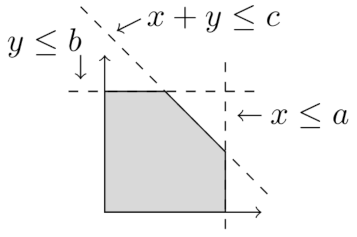
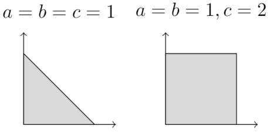

# Polylearner
The **Polylearner** algorithm is a learning algorithm that, given a set of polyhedra `P1, .., Pn`, learns
a *minimal parametrized polyhedron* `P` with parametrizations `θ1, .., θn` such that `P[θ1]` yields the same 
solution set of `θ1`.
In simple terms, `P` generalizes `P1, .., Pn` by learning a *higher-level* polyhedron and its groundings to
the *lower-level* polyhedra.

We represent polyhedra as linear systems of the form `Ax <= b`, where `A` is a coefficient matrix, and `b` is vector
of coefficients. 
Take the following parametrized system



defined by a system `P`:
```
x + y <= c
    y <= b
    x <= a
```

by setting `a, b, c` to `1` we obtain the triangle on the left, while by setting `a, b` to `1` and `c` to `2`, we 
obtain the square on the left; that is, `P` generalized both the triangle and rectangle.



# Quickstart
## Installation
```shell
mkvirtualenv -p python3.11 polylearner
pip install -r requirements.txt
```

## Python interface
Polyhedra  are defined as systems (`System` objects) representing systems of linear inequalities.
The `Polylearner` class provides a `fit(Iterable[System]) -> Optional[SymbolicParametricSystem]` learning method
to learn the generalizing parametric polyhedron.

Note that not all collections of low-level polyhedra admit a solution, hence `fit` may also return `None`. 

```python
from hyperplanes.planes import Hyperplane
from hyperplanes.systems import System
from learner.polylearner import Polylearner

# [-X =< 0, X =< 3, -Y =< 0, Y =< 2]
h1 = Hyperplane([-1., 0.], 0.)
h2 = Hyperplane([1., 0.], 3.)
h3 = Hyperplane([0., -1.], 0.)
h4 = Hyperplane([0., 1.], 2.)
s1 = System([h1, h2, h3, h4])

# [-X =< 0, X =< 2, -Y =< 0, Y =< 3]
h5 = Hyperplane([-1., 0.], 0.)
h6 = Hyperplane([1., 0.], 2.)
h7 = Hyperplane([0., -1.], 0.)
h8 = Hyperplane([0., 1.], 3.)
s2 = System([h5, h6, h7, h8])

learner = Polylearner()
learned_system = learner.fit([s1, s2])
```

The `learned_system` is an instance of `SymbolicParametrizedSystem`, a system of `SymbolicInequality`, which
can be grounded into a `SymbolicGroundedSystem`:
```python
grounding_0 = learned_system.solutions[0]
grounded_system = learned_system.ground(grounding_0)
```


## Examples
Examples on `Polylearner` usage can be found in the `notebooks/` folder.

# Cite
Work based on the [original implementation](http://pages.di.unipi.it/ruggieri/software/lps.pl) of the
"Learning from Polyhedral Sets" by S. Ruggieri.
Cite as
```
@inproceedings{DBLP:conf/ijcai/Ruggieri13,
  author    = {Salvatore Ruggieri},
  editor    = {Francesca Rossi},
  title     = {Learning from Polyhedral Sets},
  booktitle = {{IJCAI} 2013, Proceedings of the 23rd International Joint Conference
               on Artificial Intelligence, Beijing, China, August 3-9, 2013},
  pages     = {1069--1075},
  publisher = {{IJCAI/AAAI}},
  year      = {2013},
  url       = {http://www.aaai.org/ocs/index.php/IJCAI/IJCAI13/paper/view/6700},
  timestamp = {Tue, 08 Mar 2022 17:41:51 +0100},
  biburl    = {https://dblp.org/rec/conf/ijcai/Ruggieri13.bib},
  bibsource = {dblp computer science bibliography, https://dblp.org}
}
```